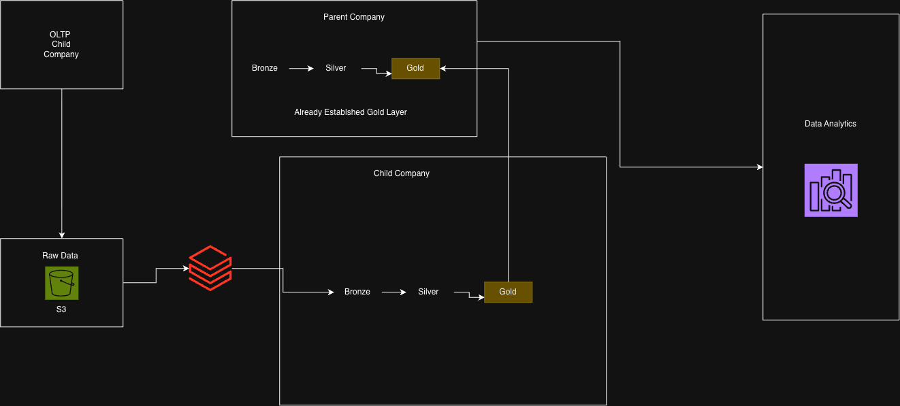
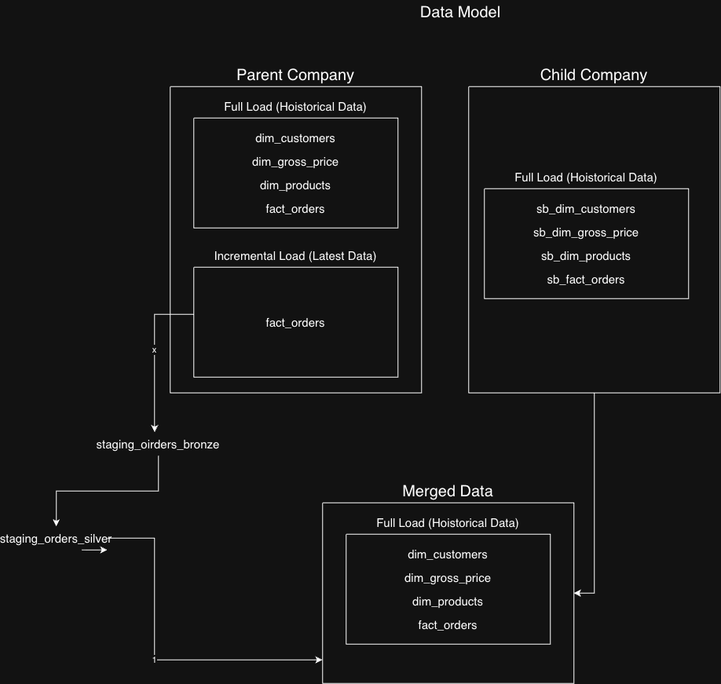

# Data Warehouse and Analytics Project

A Databricks-based data warehouse project designed to merge child-company operational data with an existing parent-company gold layer. The workflow follows a medallion architecture pattern:

- Bronze: raw ingested data from source files
- Silver: cleaned, standardized, and deduplicated data
- Gold: analytics-ready tables for reporting and business analysis

## Project Goal

The goal of this project is to ingest CSV data from an S3 landing zone, process it in Databricks, and merge the resulting data into the parent company’s existing warehouse tables. This enables unified analytics across historical parent data and newly arriving child-company data.

## Architecture Overview

## Integration Model

## Data Flow

1. Load raw CSV files from the S3 landing folder into the bronze layer
2. Clean, validate, and standardize the data in the silver layer
3. Build analytical dimension and fact tables in the gold layer
4. Merge child-company data with the parent-company gold tables
5. Enable reporting and BI consumption using the final warehouse model

## Business Context

This project includes two data sources:

- Parent company: already has historical gold-layer data
- Child company: new operational data is uploaded regularly and processed in Databricks

The pipeline supports both full-load and incremental updates, making it suitable for ongoing warehouse maintenance and near-real-time reporting.

## Repository Structure

- `0_data/` — source datasets for parent and child companies
- `consolidated_pipeline/1_setup/` — setup, utilities, and date dimension notebooks
- `consolidated_pipeline/2_dim_data_processing/` — customer, product, and pricing processing notebooks
- `consolidated_pipeline/3_fact_data_processing/` — fact table full load and incremental load notebooks
- `DataBricksProjOverView.drawio.png` — end-to-end architecture diagram
- `DataBricksProj_TableOverview.drawio.png` — warehouse and table overview diagram

## Layer View

The solution follows the standard warehouse layering pattern:

- Bronze layer stores raw ingested data
- Silver layer handles quality checks and transformations
- Gold layer creates final reporting tables

## Gold Layer Summary

The gold layer contains business-ready analytical tables such as:

- `fmcg.gold.dim_customers`
- `fmcg.gold.dim_products`
- `fmcg.gold.dim_gross_price`
- `fmcg.gold.fact_orders`

These tables are designed to support dashboards, KPI analysis, and enterprise reporting.

## S3 and Automation

The project includes S3 integration and an automated Databricks job workflow:

- Data is loaded from an S3 bucket into Databricks
- New CSV files in the `orders/landing` folder trigger data processing
- Files are moved to a processed directory after ingestion
- The merged data is updated in the gold layer using Delta merge logic

## Tools and Technologies

- Databricks
- Apache Spark / PySpark
- Delta Lake
- SQL
- AWS S3
- Databricks Jobs

## Notes

This project demonstrates a scalable lakehouse-style warehouse implementation combining data ingestion, transformation, and incremental merge patterns for analytical reporting in a real-world business scenario.

- Databricks automation
- Delta-based incremental merges
- warehouse integration between multiple companies

It is a strong example of building a scalable lakehouse architecture in Databricks for enterprise-style reporting and analytics.

---

## Summary

This project is a Databricks data warehousing solution that combines:
- parent-company gold data
- child-company processed data
- bronze-silver-gold transformation layers
- S3 landing-zone ingestion
- automated job execution on new order file arrivals
- data merge into an existing analytics-ready gold table

It serves as a complete end-to-end warehouse integration pipeline for multi-company reporting.
